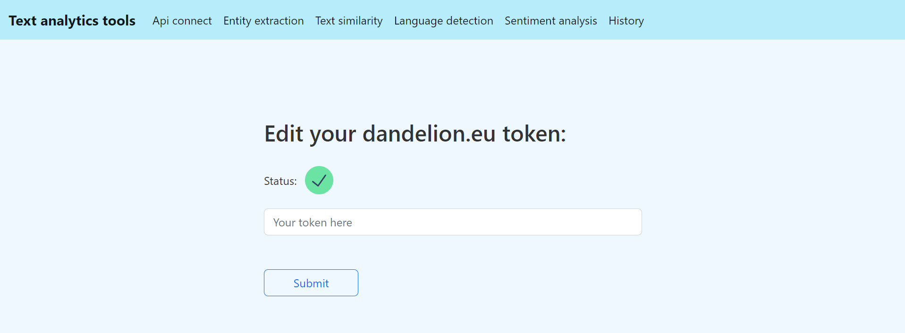
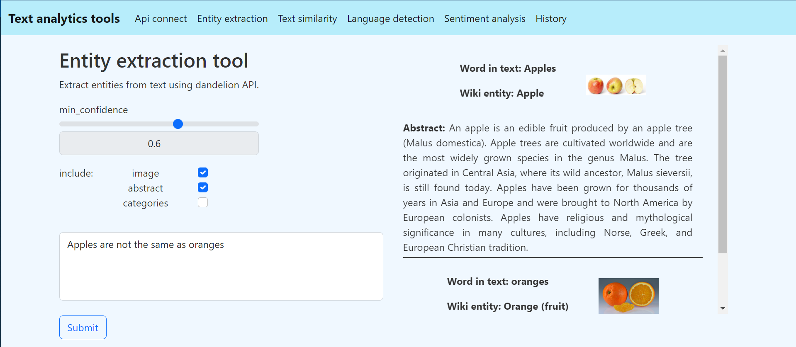
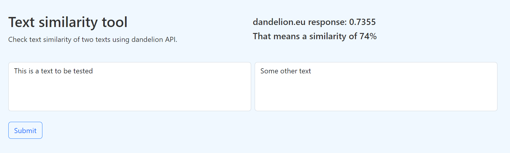
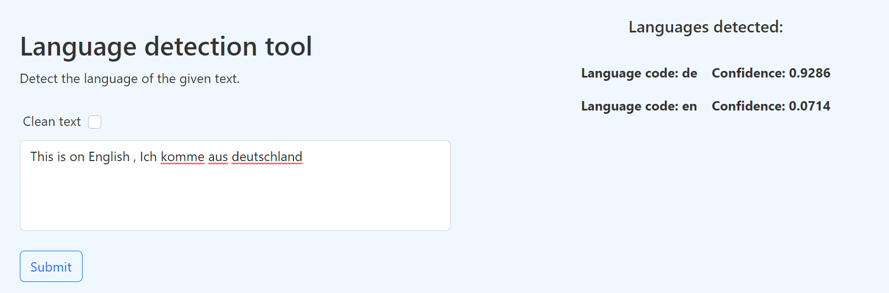
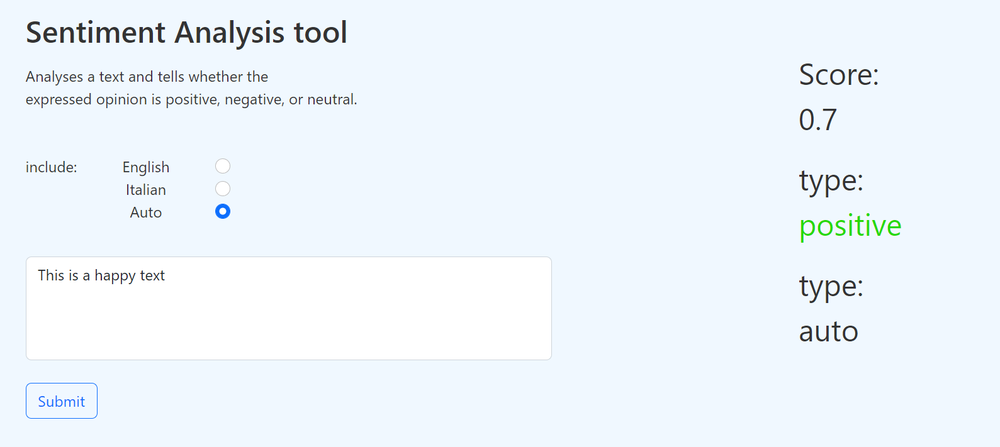

# Text analytics tools

This is an angular app that uses dandelion.eu API

It is an web app that presents dandelion API tools:
  1. Entity extraction
  2. Text similarity 
  3. Language detection
  4. Sentiment analysis
  
This app also has a History route where I use a angular service to track API requests sent to dandelion API.

Here are some pictures:

  - User of this app must be registered for dandelion API in order to use it. All registered users have their token on their dandelion dashboard.
    The token is stored in user's local storage.
  

  - Tool that extracts wiki entities from text. User can check if he also wants to see an image, categories (tags) or abstract description of entity.
    Every word has its confidence (number between 0 and 1) and with min_confidence slider, user can set the minimum confidence for entities.
    

  - Clean text checkbox is a feature that clean the text from links, hashtags, special characters ...
  

  - Color for sentiment analysis result interpolates between red and green with brown in the middle.
  If the result is -1 it will be red, if it is 1 it will be green if it is 0 it will be brown.
